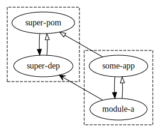

# Maven release version property example

An example project demonstrating one way to automatically set a `<property>` to the the project's `version`, that is:

```
<project>
    <artifactId>super-pom</artifactId>
    <version>1.2.3-SNAPSHOT</version>

    <properties>
        <super-pom.version>1.2.3-SNAPSHOT</super-pom.version>
    </properties>
```

where `<super-pom.version>` is updated on `mvn release:prepare` (see [commit log](https://github.com/tingstad/maven-release-version/commit/89c619541016352c3194afea632ffb8e83515694)).

See [super-pom/pom.xml](https://github.com/tingstad/maven-release-version/blob/super-pom-1.2.3/super-pom/pom.xml#L27-L59) for how this is solved.

What is it useful for? Sometimes concrete projects inherit common functionality from a super-project. If one needs to refer to the super-project's version, `${project.parent.version}` is often used. Unfortunately, this breaks down in some cases. For example, in a deeper hierarchy, you would need `parent.parent.version`. And [this](https://github.com/tingstad/maven-release-version/blob/super-pom-1.2.3/super-pom/pom.xml#L22) example would use inheriting project if `project.version` was used. Plugin dependency version is another use case for referring to a super version (they are not set by `dependencyManagement`).

The architecture of this example:



Note the different arrows for inheritance, depends, and builds. The two boxes are released independently.

This architecture is not a prerequisite for using the technique, it just demonstrates that it works in a non-trivial case.

